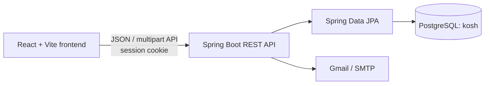

# Kosh

Kosh is a full-stack cooperative (`sahakari`) management system. It gives a platform operator a view across multiple cooperatives, while each cooperative gets its own administrators, members, financial products, applications, transactions, statements, and activity history.

The repository is an active development project, not a production-ready banking platform. Read [Current limitations and security notes](#current-limitations-and-security-notes) before deploying it or using real member data.

## What the system does

Kosh models three levels of access:

| Role | Main capabilities |
| --- | --- |
| Super-admin | Sign in by email OTP, create and manage cooperative networks, create users, review network/package analytics, and view platform activity history |
| Cooperative admin | Approve or reject members, create staff and members, manage savings/FD/loan products, review applications, post ledger transactions, inspect cooperative analytics, and view activity history |
| Member | Register under an existing cooperative, sign in with password and email 2FA, browse products, apply for savings accounts/fixed deposits/loans, view balances and transactions, download statements/reports, and manage profile/security settings |

Important workflows include:

- multi-cooperative tenant management with plan, staff, admin, and member limits;
- member onboarding with photo, citizenship document, and signature uploads;
- approval/rejection of pending accounts;
- savings account, fixed-deposit, and loan package management;
- member applications with admin review notes and approval states;
- member and cooperative ledger entries, voucher generation, and voucher emails;
- user-balance and cooperative-reserve calculations;
- EMI repayment-schedule generation for approved loans;
- PDF/report/statement export in the frontend;
- admin and super-admin activity logs;
- email OTP for login, trusted-device login, and password reset;
- light/dark appearance preferences stored in the browser.

## Architecture



- The frontend runs on `http://localhost:5173` by default.
- The backend runs on `http://localhost:8080`.
- Authentication is session-based. Frontend requests that need authentication send the session cookie with `credentials: "include"`.
- Uploaded network documents, logos, user identity files, signatures, and product banners are stored as PostgreSQL `bytea` values.
- Flyway owns the PostgreSQL schema. Hibernate runs with `spring.jpa.hibernate.ddl-auto=validate` and never creates or updates production tables.
- Frontend requests use one configured API boundary: localhost in development and same-origin `/api` by default in production. A configured production API origin must use HTTPS.

## Technology stack

### Frontend

- React 19
- Vite 7
- React Router 7
- Tailwind CSS 4
- Recharts, ApexCharts, and React ApexCharts
- Framer Motion
- jsPDF, jsPDF AutoTable, and html2canvas-pro
- Lucide and React Icons

### Backend

- Java 17
- Spring Boot 3.5
- Spring Web
- Spring Data JPA / Hibernate
- Spring Security with BCrypt password hashing
- Spring Mail
- PostgreSQL JDBC driver
- Flyway database migrations
- Maven Wrapper 3.9.11

## Repository layout

```text
.
├── backend/
│   ├── pom.xml
│   └── src/
│       ├── main/java/com/kosh/backend/
│       │   ├── config/       # Spring Security configuration
│       │   ├── controller/   # REST endpoints
│       │   ├── model/        # JPA entities and enums
│       │   ├── repository/   # Spring Data repositories
│       │   └── service/      # Email and loan schedule logic
│       └── main/resources/
│           └── application.properties
├── frontend/
│   ├── src/
│   │   ├── component/        # Shared, member, admin, and super-admin UI
│   │   └── pages/            # Route-level screens grouped by role
│   ├── package.json
│   └── vite.config.js
├── package.json              # A small legacy/root dependency file
└── README.md                 # This document
```

The installable and runnable frontend package is `frontend/package.json`, not the small package file at the repository root.

## Data model

| Entity | Purpose |
| --- | --- |
| `Network` | A cooperative, including registration/PAN details, subscription plan, capacity limits, document, and logo |
| `User` | A member or administrator, linked to a cooperative and containing authentication, balance, profile, and identity-document data |
| `SavingAccount` | A cooperative's savings product definition |
| `FixedDeposit` | A cooperative's fixed-deposit product definition |
| `LoanPackage` | A cooperative's loan product definition |
| `SavingAccountApplication` | A member's application for a savings product |
| `FixedDepositApplication` | A member's fixed-deposit application, including amount, term, rate snapshot, and maturity values |
| `LoanApplication` | A member's requested/approved loan, rate and duration snapshots, purpose, and payment dates |
| `RepaymentSchedule` | Installment-level principal, interest, due date, and repayment state for a loan |
| `Transaction` | The cooperative/member ledger entry, voucher data, account head, direction, payment details, and reserve snapshot |
| `ActivityLog` | Auditable admin or super-admin actions |

Application states are `PENDING`, `APPROVED`, `REJECTED`, and `WITHDRAWN`. Application transaction types are `DEPOSIT` and `WITHDRAW`.

## Prerequisites

- Node.js `20.19+` or `22.12+` (required by the locked Vite version)
- npm
- Java 17
- PostgreSQL 17 or 18
- Internet access on the first Maven/npm install
- A working SMTP account if login OTP, password reset, or voucher email is required

Maven does not need to be installed globally when using `backend/mvnw`. The combined frontend development script does call global `mvn`, however, so the two-terminal workflow below is more portable.

## Local setup

### 1. Clone and enter the project

```bash
git clone <repository-url>
cd kosh
```

### 2. Configure PostgreSQL and email

Provision a PostgreSQL database named `kosh` and a non-superuser runtime account. Flyway creates the complete application schema on first startup; the application no longer contains a MySQL driver, dialect, URL, or MySQL-specific query.

The backend reads sensitive values from environment variables. Set them in your shell, deployment platform, or an ignored local environment file:

```bash
export DB_URL='jdbc:postgresql://localhost:5432/kosh'
export DB_USERNAME='<postgres-runtime-user>'
export DB_PASSWORD='<postgres-runtime-password>'
export MAIL_HOST='smtp.gmail.com'
export MAIL_PORT='587'
export MAIL_USERNAME='<smtp-user>'
export MAIL_PASSWORD='<smtp-app-password>'
export SUPERADMIN_EMAIL='<authorized-superadmin-email>'
```

For Gmail, use an app password rather than an account password. Do not commit database or SMTP credentials. The previously exposed SMTP credential was rotated and purged from repository history; keep automated secret scanning in CI so credentials cannot be reintroduced.

`DB_URL` and `DB_USERNAME` have local-development defaults; configure all database, mail, and super-admin values explicitly outside local development.

To load the deterministic demonstration dataset, enable the `dev` profile before the database is migrated. Seed identities are locked by default. Supply a BCrypt hash through `SEED_PASSWORD_HASH` only when interactive local login is required; never commit or print the corresponding plaintext password.

```bash
export SPRING_PROFILES_ACTIVE='dev'
export SEED_PASSWORD_HASH='<bcrypt-hash-for-a-local-only-password>'
```

The development seed contains 2 cooperatives, 8 users, 9 products, 10 applications, 12 repayment installments, 8 transactions, and 5 activity-log entries. Production uses only `classpath:db/migration`; the seed is isolated in `classpath:db/devseed`.

The `dev` profile disables email 2FA for seeded administrator/member accounts and allows the configured development super-admin email to establish a session without email delivery. This behavior is profile-scoped; the default configuration retains OTP-based authentication and must be used outside local development.

### 3. Start the backend

```bash
cd backend
./mvnw spring-boot:run
```

On Windows:

```powershell
cd backend
./mvnw.cmd spring-boot:run
```

The API should become available at `http://localhost:8080`.

### 4. Start the frontend

In another terminal:

```bash
cd frontend
npm ci
npm run vite
```

Open `http://localhost:5173`.

If Maven is installed globally, `npm run dev` from `frontend/` starts both Vite and the backend concurrently.

## First-use bootstrap

Production has no seed data. A new production installation must be bootstrapped through the UI in this order:

1. Configure working SMTP credentials and `SUPERADMIN_EMAIL`.
2. Open `/super-login` and complete the email OTP challenge.
3. Create at least one cooperative from the super-admin Networks page.
4. Create an active admin assigned to that cooperative.
5. Members can then register from `/signup`; registration requires selecting an existing cooperative and uploading the requested identity files.
6. The cooperative admin approves pending members before they can sign in.
7. The admin creates savings, fixed-deposit, and loan products before members can apply for them.

Regular member/admin login is available at `/login`. Member/admin accounts require status `Active`; an unknown device also triggers an email OTP. The “trust this device” option stores a 30-day HTTP-only cookie.

## Main routes

| Area | Routes |
| --- | --- |
| Public/auth | `/`, `/login`, `/signup`, `/forgot`, `/super-login` |
| Member | `/home`, `/home/packages`, `/home/applications`, `/home/statement`, `/home/report`, `/home/settings` |
| Admin | `/admin`, `/admin/users`, `/admin/packages`, `/admin/applications`, `/admin/transactions`, `/admin/history`, `/admin/settings` |
| Super-admin | `/superadmin`, `/superadmin/networks`, `/superadmin/analytics`, `/superadmin/history` |

## REST API overview

All backend routes are under `/api`.

| API group | Base path | Responsibility |
| --- | --- | --- |
| Authentication | `/auth` | Member/admin login, 2FA, logout, forgot/reset password |
| Super-admin authentication | `/superadmin-auth` | Super-admin OTP login, session check, logout |
| Session | `/session` | Current session, user, and cooperative metadata |
| Networks | `/networks` | Cooperative CRUD, statistics, documents, and logos |
| Users | `/users` | Registration/user CRUD, approval, rejection, password change, identity files, and counts |
| Products | `/finance` | Savings, fixed-deposit, and loan package CRUD and banners |
| Applications | `/applications` | Submit, list, and review member product applications |
| Transactions | `/transactions` | Create and list member/cooperative ledger entries |
| Analytics | `/analytics` | Network revenue and cooperative dashboard summaries |
| History | `/history` | Admin and super-admin activity logs |

Requests that depend on a logged-in user must include the session cookie. For a browser `fetch` call:

```ts
apiFetch(`${API_BASE}/session`);
```

## Financial behavior

Transactions distinguish a member ledger from the cooperative's own ledger through `mode`, and classify entries through `accountHead` and `direction`.

- Savings and fixed deposits treat `Credit` as money added and `Debit` as money removed.
- Loans treat `Debit` as disbursement/increased outstanding principal and `Credit` as repayment/reduced outstanding principal.
- Non-loan member entries update the user's stored balance.
- A transaction can be linked to an existing application, or an admin-created product transaction can create an already-approved application.
- The stored reserve snapshot is calculated as `(savings + fixed deposits) - outstanding loans + network balance`.
- Loan approval generates equal-payment schedule rows from the approved principal, annual rate, duration, and start date.

Transactions also post balanced debit/credit lines into an append-only journal. Financial request values use `BigDecimal`, PostgreSQL stores `numeric(18,2)`, retries use cooperative-scoped idempotency keys, and corrections use reversing entries rather than edits.

## Available commands

Run frontend commands from `frontend/`:

```bash
npm run vite     # Frontend development server
npm run dev      # Frontend + backend; requires global Maven
npm run build    # Production frontend build
npm run preview  # Preview the frontend build
npm run lint     # ESLint checks
```

Run backend commands from `backend/`:

```bash
./mvnw spring-boot:run
./mvnw test
./mvnw package
```

The backend includes authorization, tenant-isolation, authentication, upload, serialization, ledger, loan, migration, and production-configuration tests. Five database-trigger invariant tests run only when `KOSH_TEST_DB` points to a disposable PostgreSQL database.

## Current limitations and security notes

The code is hardened but is not, by itself, approval to process real money or identity documents. Read [`secure.md`](secure.md) for the full before/after report, authorization matrix, ASVS mapping, test evidence, and findings register. Important remaining requirements are:

- run the five PostgreSQL invariant tests against a disposable real PostgreSQL database;
- verify all roles, cross-cooperative denial, SMTP/OTP, session, CSRF, and recovery flows end to end;
- review edge TLS/CSP, database privileges, secrets, backups/restores, monitoring, and incident response;
- add shared authentication throttling/session state before horizontal scaling;
- add upload malware scanning and an approved identity-document encryption/retention policy;
- add maker-checker/high-value transaction controls, CI security gates, and an independent penetration/accounting review.

## Build verification status

The following checks were run on 2026-08-11 for the `makeitsecure` branch:

| Check | Result |
| --- | --- |
| `./mvnw clean verify` | Passes; 105 tests, 0 failures/errors, 5 PostgreSQL-only tests skipped; 0 unsuppressed dependency findings |
| `npm run typecheck` | Passes with strict TypeScript |
| `npm run lint` | Passes |
| `npm run build` | Passes; Vite warns that the main minified chunk is about 2.33 MB and should be code-split |
| `npm audit --audit-level=low` | Passes with 0 vulnerabilities |

The frontend source contains 85 TypeScript/TSX files and no JavaScript/JSX files. See [`secure.md`](secure.md) for caveats and production blockers.
