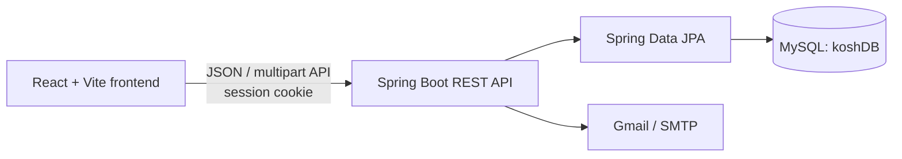

# Kosh

Kosh is a full-stack cooperative (`sahakari`) management system. It gives a platform operator a view across multiple cooperatives, while each cooperative gets its own administrators, members, financial products, applications, transactions, statements, and activity history.

The repository is an active development project, not a production-ready banking platform. Read [Current limitations and security notes](#current-limitations-and-security-notes) before deploying it or using real member data.

## What the system does

Kosh models three levels of access:

| Role | Main capabilities |
| --- | --- |
| Super-admin | Sign in by email OTP, create and manage cooperative networks, create users, review network/package analytics, and view platform activity history |
| Cooperative admin | Approve or reject members, create staff and members, manage savings/FD/loan products, review applications, post ledger transactions, inspect cooperative analytics, and view activity history |
| Member | Register under an existing cooperative, sign in with password and email 2FA, browse products, apply for savings accounts/fixed deposits/loans, view balances and transactions, download statements/reports, and manage profile/security settings |

Important workflows include:

- multi-cooperative tenant management with plan, staff, admin, and member limits;
- member onboarding with photo, citizenship document, and signature uploads;
- approval/rejection of pending accounts;
- savings account, fixed-deposit, and loan package management;
- member applications with admin review notes and approval states;
- member and cooperative ledger entries, voucher generation, and voucher emails;
- user-balance and cooperative-reserve calculations;
- EMI repayment-schedule generation for approved loans;
- PDF/report/statement export in the frontend;
- admin and super-admin activity logs;
- email OTP for login, trusted-device login, and password reset;
- light/dark appearance preferences stored in the browser.

## Architecture



- The frontend runs on `http://localhost:5173` by default.
- The backend runs on `http://localhost:8080`.
- Authentication is session-based. Frontend requests that need authentication send the session cookie with `credentials: "include"`.
- Uploaded network documents, logos, user identity files, signatures, and product banners are stored as BLOBs in MySQL.
- Hibernate creates and updates the schema automatically through `spring.jpa.hibernate.ddl-auto=update`; there are currently no versioned database migrations.
- Frontend API URLs are currently hardcoded to `http://localhost:8080/api` in many components. Vite also defines an `/api` development proxy, but most calls do not use it yet.

## Technology stack

### Frontend

- React 19
- Vite 7
- React Router 7
- Tailwind CSS 4
- Recharts, ApexCharts, and React ApexCharts
- Framer Motion
- jsPDF, jsPDF AutoTable, and html2canvas-pro
- Lucide and React Icons

### Backend

- Java 17
- Spring Boot 3.5
- Spring Web
- Spring Data JPA / Hibernate
- Spring Security with BCrypt password hashing
- Spring Mail
- MySQL Connector/J
- Maven Wrapper 3.9.11

## Repository layout

```text
.
├── backend/
│   ├── pom.xml
│   └── src/
│       ├── main/java/com/kosh/backend/
│       │   ├── config/       # Spring Security configuration
│       │   ├── controller/   # REST endpoints
│       │   ├── model/        # JPA entities and enums
│       │   ├── repository/   # Spring Data repositories
│       │   └── service/      # Email and loan schedule logic
│       └── main/resources/
│           └── application.properties
├── frontend/
│   ├── src/
│   │   ├── component/        # Shared, member, admin, and super-admin UI
│   │   └── pages/            # Route-level screens grouped by role
│   ├── package.json
│   └── vite.config.js
├── package.json              # A small legacy/root dependency file
└── README.md                 # This document
```

The installable and runnable frontend package is `frontend/package.json`, not the small package file at the repository root.

## Data model

| Entity | Purpose |
| --- | --- |
| `Network` | A cooperative, including registration/PAN details, subscription plan, capacity limits, document, and logo |
| `User` | A member or administrator, linked to a cooperative and containing authentication, balance, profile, and identity-document data |
| `SavingAccount` | A cooperative's savings product definition |
| `FixedDeposit` | A cooperative's fixed-deposit product definition |
| `LoanPackage` | A cooperative's loan product definition |
| `SavingAccountApplication` | A member's application for a savings product |
| `FixedDepositApplication` | A member's fixed-deposit application, including amount, term, rate snapshot, and maturity values |
| `LoanApplication` | A member's requested/approved loan, rate and duration snapshots, purpose, and payment dates |
| `RepaymentSchedule` | Installment-level principal, interest, due date, and repayment state for a loan |
| `Transaction` | The cooperative/member ledger entry, voucher data, account head, direction, payment details, and reserve snapshot |
| `ActivityLog` | Auditable admin or super-admin actions |

Application states are `PENDING`, `APPROVED`, `REJECTED`, and `WITHDRAWN`. Application transaction types are `DEPOSIT` and `WITHDRAW`.

## Prerequisites

- Node.js `20.19+` or `22.12+` (required by the locked Vite version)
- npm
- Java 17
- MySQL 8 or a compatible MySQL server
- Internet access on the first Maven/npm install
- A working SMTP account if login OTP, password reset, or voucher email is required

Maven does not need to be installed globally when using `backend/mvnw`. The combined frontend development script does call global `mvn`, however, so the two-terminal workflow below is more portable.

## Local setup

### 1. Clone and enter the project

```bash
git clone <repository-url>
cd kosh
```

### 2. Configure MySQL and email

Start MySQL, then update `backend/src/main/resources/application.properties` for your machine. The default database URL uses `createDatabaseIfNotExist=true`, so a sufficiently privileged MySQL user can create `koshDB` automatically.

The backend reads sensitive values from environment variables. Set them in your shell, deployment platform, or an ignored local environment file:

```bash
export DB_URL='jdbc:mysql://localhost:3306/koshDB?createDatabaseIfNotExist=true&useSSL=false&serverTimezone=UTC'
export DB_USERNAME='<mysql-user>'
export DB_PASSWORD='<mysql-password>'
export MAIL_HOST='smtp.gmail.com'
export MAIL_PORT='587'
export MAIL_USERNAME='<smtp-user>'
export MAIL_PASSWORD='<smtp-app-password>'
export SUPERADMIN_EMAIL='<authorized-superadmin-email>'
```

For Gmail, use an app password rather than an account password. Do not commit database or SMTP credentials. The current repository history contains a live-looking SMTP credential; rotate/revoke it before using this project and move secrets to environment variables or an untracked configuration file.

`DB_URL`, `DB_USERNAME`, and `DB_PASSWORD` have local-development defaults; mail credentials and `SUPERADMIN_EMAIL` do not. Configure all values explicitly outside local development.

### 3. Start the backend

```bash
cd backend
./mvnw spring-boot:run
```

On Windows:

```powershell
cd backend
./mvnw.cmd spring-boot:run
```

The API should become available at `http://localhost:8080`.

### 4. Start the frontend

In another terminal:

```bash
cd frontend
npm ci
npm run vite
```

Open `http://localhost:5173`.

If Maven is installed globally, `npm run dev` from `frontend/` starts both Vite and the backend concurrently.

## First-use bootstrap

There is no database seed script. A new installation must be bootstrapped through the UI in this order:

1. Configure working SMTP credentials and `SUPERADMIN_EMAIL`.
2. Open `/super-login` and complete the email OTP challenge.
3. Create at least one cooperative from the super-admin Networks page.
4. Create an active admin assigned to that cooperative.
5. Members can then register from `/signup`; registration requires selecting an existing cooperative and uploading the requested identity files.
6. The cooperative admin approves pending members before they can sign in.
7. The admin creates savings, fixed-deposit, and loan products before members can apply for them.

Regular member/admin login is available at `/login`. Member/admin accounts require status `Active`; an unknown device also triggers an email OTP. The “trust this device” option stores a 30-day HTTP-only cookie.

## Main routes

| Area | Routes |
| --- | --- |
| Public/auth | `/`, `/login`, `/signup`, `/forgot`, `/super-login` |
| Member | `/home`, `/home/packages`, `/home/applications`, `/home/statement`, `/home/report`, `/home/settings` |
| Admin | `/admin`, `/admin/users`, `/admin/packages`, `/admin/applications`, `/admin/transactions`, `/admin/history`, `/admin/settings` |
| Super-admin | `/superadmin`, `/superadmin/networks`, `/superadmin/analytics`, `/superadmin/history` |

## REST API overview

All backend routes are under `/api`.

| API group | Base path | Responsibility |
| --- | --- | --- |
| Authentication | `/auth` | Member/admin login, 2FA, logout, forgot/reset password |
| Super-admin authentication | `/superadmin-auth` | Super-admin OTP login, session check, logout |
| Session | `/session` | Current session, user, and cooperative metadata |
| Networks | `/networks` | Cooperative CRUD, statistics, documents, and logos |
| Users | `/users` | Registration/user CRUD, approval, rejection, password change, identity files, and counts |
| Products | `/finance` | Savings, fixed-deposit, and loan package CRUD and banners |
| Applications | `/applications` | Submit, list, and review member product applications |
| Transactions | `/transactions` | Create and list member/cooperative ledger entries |
| Analytics | `/analytics` | Network revenue and cooperative dashboard summaries |
| History | `/history` | Admin and super-admin activity logs |

Requests that depend on a logged-in user must include the session cookie. For a browser `fetch` call:

```js
fetch("http://localhost:8080/api/session", {
  credentials: "include",
});
```

## Financial behavior

Transactions distinguish a member ledger from the cooperative's own ledger through `mode`, and classify entries through `accountHead` and `direction`.

- Savings and fixed deposits treat `Credit` as money added and `Debit` as money removed.
- Loans treat `Debit` as disbursement/increased outstanding principal and `Credit` as repayment/reduced outstanding principal.
- Non-loan member entries update the user's stored balance.
- A transaction can be linked to an existing application, or an admin-created product transaction can create an already-approved application.
- The stored reserve snapshot is calculated as `(savings + fixed deposits) - outstanding loans + network balance`.
- Loan approval generates equal-payment schedule rows from the approved principal, annual rate, duration, and start date.

This is application-level bookkeeping, not double-entry accounting. Financial calculations use Java `Double`, so the code should be migrated to `BigDecimal` with explicit rounding rules before handling real money.

## Available commands

Run frontend commands from `frontend/`:

```bash
npm run vite     # Frontend development server
npm run dev      # Frontend + backend; requires global Maven
npm run build    # Production frontend build
npm run preview  # Preview the frontend build
npm run lint     # ESLint checks
```

Run backend commands from `backend/`:

```bash
./mvnw spring-boot:run
./mvnw test
./mvnw package
```

The only backend test currently included is a Spring context-load smoke test, which expects the configured database to be reachable.

## Current limitations and security notes

Do not expose the current backend directly to the internet. The most important issues found in the present code are:

- Spring Security permits every request and CSRF is disabled. Some controllers check the session manually, but authorization is not consistently enforced across CRUD endpoints.
- An SMTP username and app-password-like secret existed in earlier Git history. Rotate the credential and purge it from published history before treating the repository as private again.
- Several user endpoints serialize the JPA `User` entity directly. Sensitive fields such as password hashes and authentication tokens are not consistently excluded from JSON responses.
- CORS origins and frontend API URLs are hardcoded for local development.
- OTPs are generated with `java.util.Random` and stored only in application memory. Password-reset OTPs have no expiry, and all OTP state disappears after a restart.
- There are no migrations, seeded development data, integration tests, or end-to-end tests.
- The frontend dependency audit currently reports 19 known vulnerabilities: 1 low, 2 moderate, 11 high, and 5 critical.
- Money is represented by floating-point `Double` values.
- Uploaded files are stored in the database without an evident size/type policy.
- Multi-step approval and transaction operations are not consistently wrapped in database transactions, so partial writes are possible if a later step fails.
- The UI calls three routes that are not implemented by the backend: `GET /api/networks/recent`, `GET /api/analytics/network-snapshot`, and `PUT /api/transactions/{id}/status`.
- Only the super-admin area has an explicit frontend protected-route wrapper; member and admin route protection relies mainly on individual API/session behavior.

Before production use, centralize role-based authorization, externalize secrets and URLs, add DTOs that never expose credential fields, introduce database migrations and transactional service boundaries, validate uploads and money operations, and add automated tests.

## Build verification status

The following checks were run while creating this README:

| Check | Result |
| --- | --- |
| `mvn -DskipTests package` | Passes |
| `mvn test` | Passes the single Spring context-load test against the configured MySQL instance |
| `npm run build` | Passes; Vite warns that the main minified JavaScript chunk is about 2.34 MB and should be code-split |
| `npm run lint` | Fails with 31 errors and 10 warnings, mostly unused variables and React hook dependencies; `frontend/src/pages/user/Statement.jsx` also references undefined `todayStr` |

The smoke test starts the full Spring context and may create/update the `koshDB` schema because Hibernate DDL mode is `update`. Use a dedicated test database before expanding the test suite.
